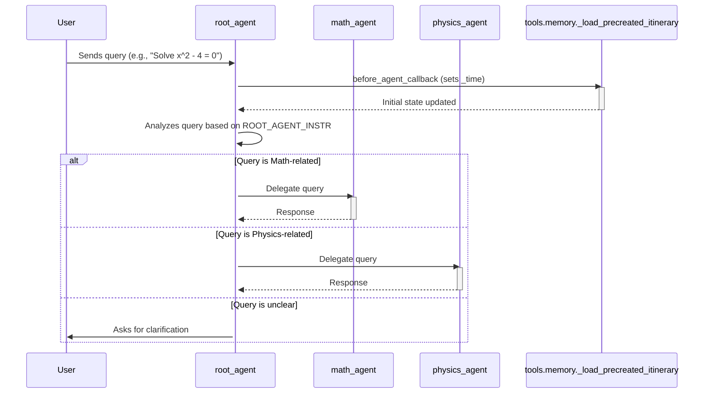

# Technical Documentation: AI Tutor Agent

This document provides a comprehensive overview of the AI Tutor Agent, its architecture, components, and how it operates. The AI Tutor Agent is designed to assist students in subjects like Mathematics and Physics by leveraging specialized sub-agents and various tools.
#### Frontend Documentation is available at [AI Tutor Agent Frontend Documentation](./tutor-agent-web/README.md)

## 1. Overview

The **AI Tutor Agent** is a Python-based application built using the Google Agent Development Kit (ADK). It's designed to assist students by understanding their questions and delegating them to specialized sub-agents for subjects like **Mathematics** and **Physics**. The agent system leverages Large Language Models (LLMs) (specifically `gemini-2.0-flash`) and a suite of tools to provide explanations, solve problems, and visualize concepts.

---

## 2. Architecture

The system employs a hierarchical agent architecture:

* **Root Agent** (`root_agent`): Acts as the main entry point and dispatcher. It analyzes the user's query and routes it to the appropriate sub-agent.
* **Sub-Agents**:

  * **Math Agent** (`math_agent`): Specializes in handling mathematics-related questions.
  * **Physics Agent** (`physics_agent`): Specializes in handling physics-related questions.
* **Tools**: A collection of utilities that sub-agents can use to perform specific tasks like calculations, formula lookups, symbolic math operations, plotting, and circuit visualization.



---

## 3. Directory Structure

```
tutor_agent/
├── __init__.py                 # Initializes the tutor_agent package
├── agent.py                    # Defines the root_agent
├── prompt.py                   # Contains prompts for the root_agent
├── shared_libs/                # Shared utilities and constants
│   ├── __init__.py
│   ├── constants.py            # Defines constants for session state keys
│   └── types.py                # (Currently empty) Type definitions
├── sub_agents/                 # Contains specialist sub-agents
│   ├── __init__.py
│   ├── math_agent/             # Mathematics sub-agent
│   │   ├── __init__.py
│   │   ├── agent.py            # Defines the math_agent
│   │   └── prompt.py           # Contains prompts for the math_agent
│   └── physics_agent/          # Physics sub-agent
│       ├── __init__.py
│       ├── agent.py            # Defines the physics_agent
│       └── prompt.py           # Contains prompts for the physics_agent
└── tools/                      # Contains various tools used by agents
    ├── __init__.py
    ├── calculator.py           # Numerical calculation tool
    ├── circuit_visualization.py # Tool for drawing circuit diagrams
    ├── formula_lookup.py       # Tool for looking up formulas
    ├── memory.py               # Utility for managing initial session state
    ├── plotting.py             # Tool for plotting mathematical functions
    └── symbolic_math.py        # Tool for symbolic math operations
```

---

## 4. Core Components

### 4.1. Root Agent (`tutor_agent/agent.py`)

* **Name**: `root_agent`
* **Model**: `gemini-2.0-flash`
* **Description**: "AI Tutor using the services of multiple sub-agents"
* **Instruction Source**: `tutor_agent/prompt.py` → `ROOT_AGENT_INSTR`

**Responsibilities**:

1. Receives the user's query.
2. Determines the subject matter of the query.
3. Delegates the query to either `math_agent` or `physics_agent`.
4. Uses the `_load_precreated_itinerary` function from `tools/memory.py` as a **before\_agent\_callback** to set up initial session states (e.g., current time).

**Sub-Agents Registered**:

* `math_agent`
* `physics_agent`

---

### 4.2. Math Agent (`tutor_agent/sub_agents/math_agent/agent.py`)

* **Name**: `math_agent`
* **Model**: `gemini-2.0-flash`
* **Description**: "Handles mathematics-related questions and problems."
* **Instruction Source**: `tutor_agent/sub_agents/math_agent/prompt.py` → `MATH_AGENT_INSTR`

**Responsibilities**:

* Provides explanations for mathematical concepts.
* Solves math problems step-by-step.
* Ensures all mathematical expressions are formatted in LaTeX.

**Tools**:

* `calculator_tool`
* `formula_lookup_tool`
* `symbolic_math_tool`
* `plotting_tool`

---

### 4.3. Physics Agent (`tutor_agent/sub_agents/physics_agent/agent.py`)

* **Name**: `physics_agent`
* **Model**: `gemini-2.0-flash`
* **Description**: "Handles physics-related questions, problems, and concepts."
* **Instruction Source**: `tutor_agent/sub_agents/physics_agent/prompt.py` → `PHYSICS_AGENT_INSTR`

**Responsibilities**:

* Provides explanations for physics concepts.
* Solves physics problems step-by-step, including identifying principles and formulas.
* Ensures all mathematical and physical expressions are formatted in LaTeX.
* Manages units and dimensional consistency.

**Tools**:

* `calculator_tool`
* `formula_lookup_tool`
* `symbolic_math_tool`
* `circuit_visualization_tool`

---

## 5. Tools (`tutor_agent/tools/`)

### 5.1. Calculator (`calculator.py`)

* **Function**: `calculator_tool(expression: str, tool_context: ToolContext) -> dict`
* **Description**: Evaluates a mathematical expression string.
* **Input**: `expression` (e.g., "2*pi*5").
* **Output**: `{"result": value}` or `{"error": message}`.
* **Note**: Uses `eval()`; consider a safer parser for production.

### 5.2. Circuit Visualization (`circuit_visualization.py`)

* **Function**: `circuit_visualization_tool(components: List[Dict], tool_context: ToolContext, title: str = "Circuit Diagram", show_labels: bool = True, grid: bool = False) -> dict`
* **Description**: Generates an SVG image of an electrical circuit diagram.
* **Dependencies**: `schemdraw`.
* **Supported Components**: Resistor, Capacitor, Inductor, Voltage Source, Current Source, Diode, LED, Zener, Transistors, Ground, Wire, Switch, Fuse, Opamp.

### 5.3. Formula Lookup (`formula_lookup.py`)

* **Function**: `formula_lookup_tool(query: str, subject: str, tool_context: ToolContext) -> dict`
* **Description**: Retrieves formulas/constants from a predefined database.
* **Input**: `query` (e.g., "area of circle"), `subject` ("math" or "physics").
* **Output**: Dictionary with formula details or an error.

### 5.4. Memory (`memory.py`)

* **Function**: `_load_precreated_itinerary(callback_context: CallbackContext)`

  * Sets up initial session state (e.g., injects `_time`).
* **Function**: `_set_initial_states(source: Dict, target: State)`

  * Helper to ensure `_time` is present.

### 5.5. Plotting (`plotting.py`)

* **Function**: `plotting_tool(equations: List[str], x_range: List[float], tool_context: ToolContext, labels: List[str], title: str, x_label: str, y_label: str, plot_type: str) -> dict`
* **Description**: Generates a Plotly JSON representation of plots.
* **Dependencies**: `numpy`, `plotly`, `sympy`.

### 5.6. Symbolic Math (`symbolic_math.py`)

* **Function**: `symbolic_math_tool(operation: str, expression: str, tool_context: ToolContext, variable: str = "x", limit_point: str = "0") -> dict`
* **Description**: Performs symbolic operations (solve, derivative, integral, expand, factor, simplify, limit).
* **Dependencies**: `sympy`.

---

## 6. Prompts

### 6.1. Root Agent Prompt (`tutor_agent/prompt.py`)

* **Variable**: `ROOT_AGENT_INSTR`
* **Purpose**: Guides `root_agent` to identify subject matter and delegate queries, using context and time injection.

### 6.2. Math Agent Prompt (`tutor_agent/sub_agents/math_agent/prompt.py`)

* **Variable**: `MATH_AGENT_INSTR`
* **Purpose**: Instructs `math_agent` to teach math concepts, solve problems step-by-step, and format all math in LaTeX.

### 6.3. Physics Agent Prompt (`tutor_agent/sub_agents/physics_agent/prompt.py`)

* **Variable**: `PHYSICS_AGENT_INSTR`
* **Purpose**: Instructs `physics_agent` to teach physics concepts, solve problems step-by-step with units, and draw circuits when needed.

---

## 7. Shared Libraries (`tutor_agent/shared_libs/`)

### 7.1. `constants.py`

* **Purpose**: Defines constants for ADK session state.
* **Constants**:

  * `SYSTEM_TIME = "_time"` – Key for current time in session.

### 7.2. `types.py`

* **Purpose**: Placeholder for shared type definitions (currently empty).

---

## 8. Dependencies

* **Core**: `google-adk` (framework for agent system).
* **Tools**:

  * `schemdraw`
  * `numpy`
  * `plotly`
  * `sympy`

---