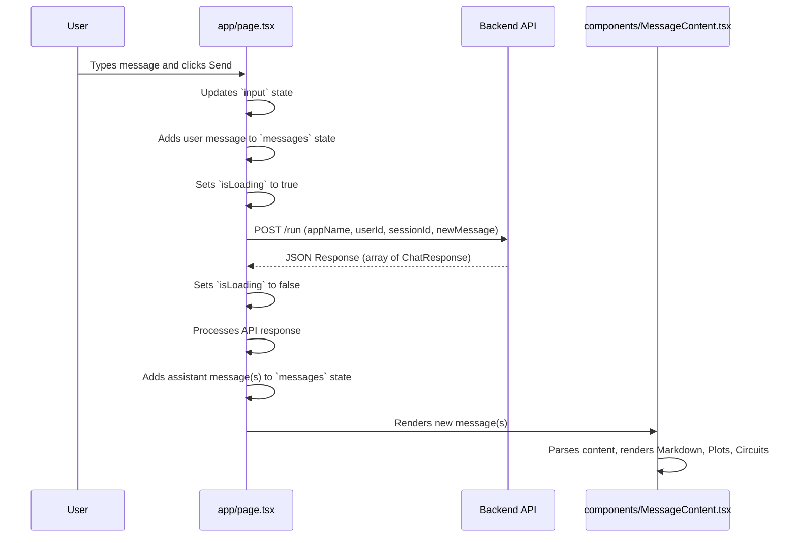
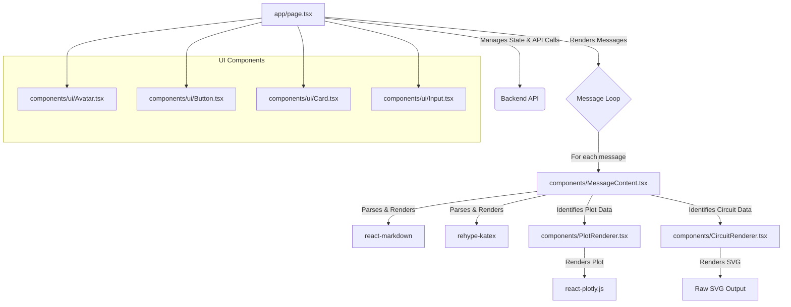

**# Tutor Agent Client - Technical Documentation**

## 1. Overview

This document provides a detailed technical overview of the Tutor Agent client website. The application is a web-based interface for interacting with an AI-powered tutor. Users can send messages to the tutor agent and receive responses, including:

* **Text**
* **Mathematical expressions** (rendered with KaTeX)
* **Plots** (rendered with Plotly.js)
* **Circuit diagrams**

## 2. Technology Stack

* **Framework:** Next.js (v15.3.2) with Turbopack
* **Language:** TypeScript
* **UI Components:** Shadcn UI (customizable components built with Radix UI and Tailwind CSS)
* **Styling:** Tailwind CSS (v4), global CSS
* **State Management:** React Hooks (`useState`, `useRef`, `useEffect`, `useCallback`, `useMemo`)
* **Linting:** ESLint (with Next.js core web vitals and TypeScript configurations)
* **Package Management:** npm/Bun (as indicated by `bun.lock` and `package-lock.json`)

### Rendering

* **Markdown:** `react-markdown`
* **Mathematical Equations:** `remark-math`, `rehype-katex`, KaTeX
* **Plots:** `plotly.js`, `react-plotly.js`
* **Circuit Diagrams:** Custom `CircuitRenderer` component (renders SVG)

## 3. Project Structure

The project follows a standard Next.js App Router structure:

```bash
tutor-agent-web/
├── README.md                   # Project overview and setup instructions
├── bun.lock                    # Bun lock file
├── components.json             # Shadcn UI configuration
├── eslint.config.mjs           # ESLint configuration
├── next.config.ts              # Next.js configuration
├── package-lock.json           # NPM lock file
├── package.json                # Project dependencies and scripts
├── postcss.config.mjs          # PostCSS configuration (for Tailwind CSS)
├── tsconfig.json               # TypeScript configuration
├── .env.example                # Example environment variables
├── .gitignore                  # Files and directories to ignore in Git
├── app/                        # Next.js App Router directory
│   ├── globals.css             # Global CSS styles and Tailwind directives
│   ├── layout.tsx              # Root layout component
│   └── page.tsx                # Main page component (chat interface)
├── components/                 # Reusable React components
│   ├── CircuitRenderer.tsx     # Component to render circuit diagrams (SVG)
│   ├── MessageContent.tsx      # Renders Markdown, plots, circuits
│   ├── PlotRenderer.tsx        # Renders Plotly.js charts
│   └── ui/                     # Shadcn UI components
│       ├── avatar.tsx
│       ├── button.tsx
│       ├── card.tsx
│       ├── input.tsx
│       └── scroll-area.tsx
├── lib/                        # Utility functions
│   └── utils.ts                # General utilities (e.g., `cn` for class names)
└── public/                     # Static assets (e.g., favicon.svg)
```

## 4. Core Components and Functionality

### 4.1 `app/page.tsx` – Main Chat Interface

**Key Functionalities:**

* **State Management:**

  * `messages`: Array of message objects (chat history)
  * `input`: Current user input string
  * `isLoading`: Indicates if a message is being processed
  * `sessionId`: Identifies the current user session
  * `sessionInitialized`: Ref to track session initialization

* **Session Initialization (`initializeSession`):**

  * Called on mount to establish a session via `POST /apps/{appName}/users/{userId}/sessions/{newSessionId}`
  * Handles authentication errors (401) and other API errors
  * Uses `NEXT_PUBLIC_API_URL` and `NEXT_PUBLIC_AUTH_TOKEN`

* **Sending Messages (`sendMessage`):**

  * Triggered on form submit
  * `POST /run` with `appName`, `userId`, `sessionId`, and new message payload
  * Processes JSON response (array of `ChatResponse` objects)
  * Updates `messages` state and handles loading/errors

* **Rendering Messages:**

  * Maps over `messages` to display user and assistant messages
  * Uses `Avatar` for icons and `MessageContent` for content rendering

* **UI Elements:**

  * `Card`, `Input`, `Button`, styled scrollable message list
  * `messagesEndRef` for auto-scrolling

* **Error Handling:**

  * Displays error messages for auth or network failures



### 4.2 `components/MessageContent.tsx`

Responsible for rendering a single message’s content:

* **Markdown Rendering:** `react-markdown`
* **LaTeX:** `remark-math`, `rehype-katex` (imports KaTeX CSS)
* **Plot Rendering (`extractPlotData`, `PlotRenderer`):**

  * Parses `functionResponse` with name `plotting_tool`
  * Decodes base64-encoded binary data (`bdata`) into JS arrays
  * Calls `PlotRenderer` for charts
* **Circuit Rendering (`extractCircuitData`, `CircuitRenderer`):**

  * Parses `functionResponse` with name `circuit_visualization_tool`
  * Decodes base64 SVG and passes to `CircuitRenderer`
* **Content Cleaning:** Removes raw JSON and base64 artifacts
* **Custom Markdown Elements:** Custom renderers for code blocks, headings, lists, tables, etc.
* **Layout Callback:** `setHasPlot` to adjust parent layout if needed

### 4.3 `components/PlotRenderer.tsx`

Renders interactive plots using `react-plotly.js`:

* **Dynamic Import:** Client-only import via `next/dynamic`
* **Data Processing:**

  * `decodeBinaryData`: Converts base64 to `ArrayBuffer`, then to number array
  * `processPlotData`: Applies decoding to each trace
* **Rendering:**

  * `<Plot />` component with responsive layout
  * Loading indicator and error handling

### 4.4 `components/CircuitRenderer.tsx`

Renders circuit diagrams from base64 SVG:

* **SVG Decoding:** `atob()` to get raw SVG markup
* **Rendering:** Uses `dangerouslySetInnerHTML` for SVG
* **Error Handling:** Displays fallback if decoding fails

### 4.5 Shadcn UI Components (`components/ui/`)

Standard UI primitives styled with Tailwind and Radix:

* `avatar.tsx`, `button.tsx`, `card.tsx`, `input.tsx`, `scroll-area.tsx`

### 4.6 `lib/utils.ts`

* **`cn` Function:** Combines `clsx` and `tailwind-merge` for conditional class names

## 5. Key Configuration Files

* **`next.config.ts`**: Next.js configuration (redirects, rewrites, env vars)
* **`tsconfig.json`**: TypeScript settings (ES2017, `esnext`, `preserve`, path aliases)
* **Tailwind CSS**: Configured via `postcss.config.mjs` and `globals.css`:

  * Imports Tailwind directives and animations
  * Defines custom theme variables, light/dark palettes
* **`postcss.config.mjs`**: Uses `@tailwindcss/postcss` plugin
* **`eslint.config.mjs`**: FlatCompat with `next/core-web-vitals` and `next/typescript`
* **`components.json`**: Shadcn UI configuration (RSC, Tailwind paths, aliases)
* **`.env.example`**:

  ```env
  NEXT_PUBLIC_API_URL=<https://api.example.com>
  NEXT_PUBLIC_AUTH_TOKEN=<your_token>
  ```

## 6. API Interaction

* **Base URL:** `NEXT_PUBLIC_API_URL` (e.g., `http://localhost:8000`)
* **Authentication:** Optional Bearer token via `NEXT_PUBLIC_AUTH_TOKEN`
* **Endpoints:**

  * **Session Creation:** `POST /apps/{appName}/users/{userId}/sessions/{newSessionId}`
  * **Send Message:** `POST /run`

**Request Body (`/run`):**

```json
{
  "appName": "tutor_agent",
  "userId": "u_123",
  "sessionId": "s_{timestamp}",
  "newMessage": {
    "role": "user",
    "parts": [{ "text": "User's message content" }]
  }
}
```

**Response Body:** Array of `ChatResponse` objects, each containing:

* `id`, `author`, `timestamp`
* `content.parts`: May include text, `functionCall`, or `functionResponse` for plots and circuits

## 7. Component Interaction Diagram



## 8. Styling

* **Tailwind CSS v4:** Utility-first styling
* **Global Styles:** `globals.css` for base, components, utilities, animations
* **Dark Mode:** Custom `dark` variant and CSS variables
* **Shadcn UI Components:** Leverage theme variables via `components.json`

## 9. Linting and Code Quality

* **ESLint:** Configured in `eslint.config.mjs`

  * FlatCompat, `next/core-web-vitals`, `next/typescript`
* **TypeScript:** Enforced via `tsconfig.json`

## 10. Environment Variables

* **`NEXT_PUBLIC_API_URL`**: Backend endpoint
* **`NEXT_PUBLIC_AUTH_TOKEN`**: Optional Bearer token

## 11. Build and Deployment

* **Development:** `npm run dev` or `bun dev` (with Turbopack)
* **Production Build:** `npm run build`
* **Start:** `npm run start`
* **Deployment:** Recommended on Vercel for Next.js optimizations
